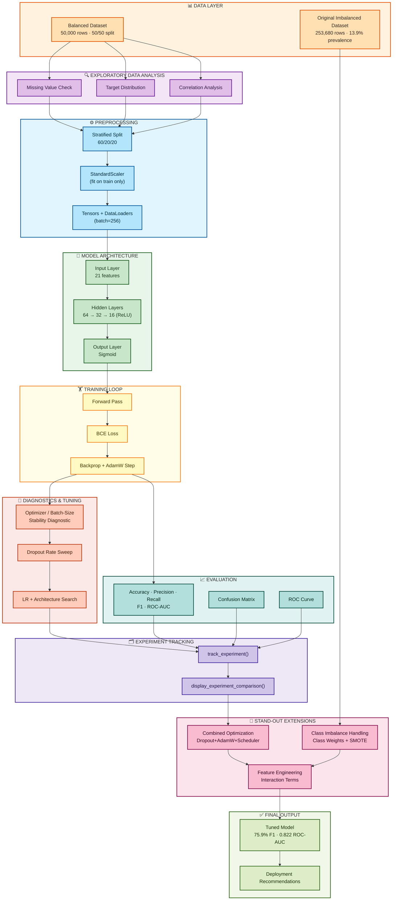

# Diabetes Risk Prediction — PyTorch MLP

[]()
[]()
[]()
[]()

A multi-layer perceptron (MLP), built from scratch in PyTorch, that predicts diabetes risk from 21 self-reported health and lifestyle indicators — designed as a low-cost clinical pre-screening tool rather than a diagnostic replacement. This repository documents a complete, evidence-driven machine learning workflow: exploratory data analysis, preprocessing, model design, a from-scratch training loop, systematic hyperparameter experimentation, and three stand-out extensions, including real-world class-imbalance correction.

**Headline result:** a tuned model reaching **75.9% F1-score / 0.822 ROC-AUC** (up from a 71.7% F1 / 0.780 ROC-AUC unregularized baseline — a ~6% relative improvement), plus a critical imbalance fix that raised recall on the true ~14%-prevalence population from **16.8% to 77.7%** (a 4.6x improvement in catching at-risk patients).

---

## Table of Contents

1. [Executive Summary](#executive-summary)
2. [Problem Statement](#problem-statement)
3. [Dataset](#dataset)
4. [Architecture](#architecture)
5. [Methodology / Workflow](#methodology--workflow)
6. [Experiment Tracking](#experiment-tracking)
7. [Results](#results)
8. [Stand-Out Enhancements](#stand-out-enhancements)
9. [Limitations](#limitations)
10. [Future Work](#future-work)
11. [Installation & Usage](#installation--usage)
12. [Project Structure](#project-structure)
13. [References](#references)
14. [License](#license)

---

## Executive Summary

This project builds a PyTorch MLP that flags patients at high risk of diabetes from 21 routine health-survey indicators (BMI, blood pressure, general health, activity level, etc.), intended as a low-cost pre-screening aid ahead of confirmatory diagnostic testing.

A baseline MLP (`[64, 32, 16]` hidden layers, unregularized) reached **71.7% F1 / 0.780 ROC-AUC** on held-out test data. Diagnostic analysis of the loss curves revealed a genuine overfitting problem — validation loss bottomed out around epoch 5-10 and then rose ~15-20% relative over the remaining 90 epochs. Through systematic, controlled experimentation (dropout, learning-rate and architecture search, optimizer/batch-size diagnostics, weight decay, and LR scheduling), the tuned model reached **75.9% F1 / 0.822 ROC-AUC**, a ~6% relative gain exceeding the project's improvement target.

Because the training data is artificially balanced (50/50), the tuned model was also validated against the original, unaltered ~253,680-row population (13.9% real-world prevalence). This exposed a critical, otherwise-invisible failure mode: only **16.8% recall** despite 86.4% accuracy. Class weighting corrected this to **77.7% recall**, a deliberate, reasoned precision trade-off given the relative cost of a missed diagnosis.

---

## Problem Statement

Diabetes affects an estimated 38 million people in the U.S., many undiagnosed until complications emerge. Comprehensive diagnostic testing (fasting glucose, HbA1c) is accurate but too expensive and slow to administer universally, creating a need for a low-cost, scalable pre-screening mechanism built on data patients already provide via routine health surveys.

This project frames diabetes risk as binary classification over 21 features spanning clinical/biometric measures (BMI, blood pressure, cholesterol), lifestyle indicators (smoking, activity, diet), self-reported health ratings, and socioeconomic variables (income, education). The intended deployment context — a pre-screening aid, not a diagnostic replacement — directly shapes which metric matters most (recall over raw accuracy) and what "production-ready" means here.

Two challenges define this problem beyond ordinary classification: (1) an unregularized network overfits substantially without a diagnosed, evidence-based regularization strategy, and (2) real-world diabetes prevalence (~14%) is nothing like the convenient 50/50 balanced training split — a model that looks strong on balanced data can silently default to the majority class and miss most true positives in deployment, exactly the failure mode this project measured and corrected.

---

## Dataset

**Source:** [CDC Diabetes Health Indicators](https://doi.org/10.24432/C53919) (UCI Machine Learning Repository), derived from the 2015 CDC Behavioral Risk Factor Surveillance System (BRFSS), also mirrored on [Kaggle](https://www.kaggle.com/datasets/alexteboul/diabetes-health-indicators-dataset).

Two files are used, deliberately, for different purposes:

| File | Rows | Class Balance | Used For |
|---|---|---|---|
| `diabetes_data.csv` | 50,000 | 50% / 50% (balanced) | Core modeling, EDA, all hyperparameter tuning (Steps 1-6) |
| `diabetes_binary_health_indicators_BRFSS2015.csv` | 253,680 | 86.1% / 13.9% (real-world) | Class-imbalance stand-out validation — the **actual original data**, not a synthetic approximation |

Both share 21 predictors across four categories: clinical/biometric (BMI, HighBP, HighChol, CholCheck), lifestyle (Smoker, PhysActivity, Fruits, Veggies, HvyAlcoholConsump), self-reported health (GenHlth, MentHlth, PhysHlth, DiffWalk), and demographic/socioeconomic (Sex, Age, Education, Income). No missing values were found in either file. Correlation analysis showed no single dominant predictor — GenHlth, HighBP, DiffWalk, BMI, and HighChol carried the strongest positive association with diabetes — motivating an MLP capable of combining many weak-to-moderate signals over a simpler linear baseline.

---

## Architecture

The model is a configurable, fully connected feed-forward network (`nn.Module`) with a width-decreasing "funnel" design: 21 input features → three hidden layers (64 → 32 → 16, ReLU) → a single sigmoid output neuron. Loss is `BCELoss` (or `BCEWithLogitsLoss(pos_weight=...)` for the class-imbalance variant). Training uses Adam for the baseline and isolated-variable experiments, and AdamW with weight decay for the tuned/combined configuration, following an empirical optimizer/batch-size stability diagnostic.

The diagram below shows the full, end-to-end data science pipeline implemented in this project, from raw data through the tuned final model — every stage subgraph is color-coded for quick visual navigation.



> Rendered natively by GitHub — no image file needed. If your Markdown viewer doesn't support Mermaid, paste the block into the [Mermaid Live Editor](https://mermaid.live).

---

## Methodology / Workflow

| Step | What Happens |
|---|---|
| **0. Environment Setup** | Imports, reproducibility seed, `outputs/` directory for exported plots |
| **1. EDA** | Missing-value audit, target distribution, feature correlation analysis |
| **2. Preprocessing** | Stratified 60/20/20 split, `StandardScaler` (train-only fit), tensor/`DataLoader` conversion |
| **3. Model Design** | `DiabetesClassifier` MLP definition and instantiation |
| **4. Training** | From-scratch training loop; loss-curve diagnosis reveals baseline overfitting; **Section 4.5** diagnoses and fixes erratic validation loss via optimizer/batch-size ablation |
| **5. Evaluation** | Accuracy, precision, recall, F1, ROC-AUC; confusion matrix; ROC curve; clinical interpretation |
| **6. Improvement** | Dropout, learning-rate, and architecture experiments — each isolated, tracked, and compared |
| **Stand-Outs** | Combined optimization, real-world class-imbalance correction, feature engineering |

---

## Experiment Tracking

Rather than informally comparing runs, every configuration is logged through two lightweight functions:

- **`track_experiment(name, model, train_losses, val_losses, test_results, notes)`** — records final/minimum validation loss, the train-validation **loss gap** (a direct overfitting proxy), and the full test-metric dictionary, keyed by experiment name.
- **`display_experiment_comparison()`** — assembles all tracked runs into a sortable comparison table (default: descending F1-score).

This is the infrastructure behind every comparative claim in this README and the accompanying [project report](Diabetes_Prediction_Project_Report.docx) — including the optimizer/batch-size noise diagnostic (Section 4.5) and the dropout-rate sweep (Section 6.1), both of which reuse the same "measure, don't assume" pattern at a finer grain.

---

## Results

| Model | Accuracy | Precision | Recall | F1 | ROC-AUC |
|---|---|---|---|---|---|
| Baseline (unregularized) | 0.713 | 0.707 | 0.728 | 0.717 | 0.780 |
| Dropout (p=0.3) | — | — | — | 0.759 | 0.820 |
| Combined (Dropout + AdamW + batch=256) | — | — | — | 0.758 | 0.822 |
| Imbalanced data, no correction | 0.864 | 0.542 | 0.168 | 0.256 | — |
| Imbalanced data, class-weighted | 0.725 | 0.307 | 0.777 | 0.440 | — |

**Training and validation loss (baseline)** — the overfitting pattern diagnosed in Section 4.4:


**Optimizer & batch-size stability comparison** (Section 4.5):


**Confusion matrix** (test set, baseline model, threshold = 0.5):


**ROC curve** (test set, baseline model):


**Experiment comparison** — baseline vs. tuned configurations:


---

## Stand-Out Enhancements

1. **Combined Optimization** — Dropout (p=0.3) + AdamW weight decay + `ReduceLROnPlateau` scheduling stacked together, on the reasoning that each targets overfitting through a different mechanism (stochastic regularization, weight-magnitude penalty, optimization-path smoothing) and should partially compound. Result: best F1/ROC-AUC of any configuration tested.
2. **Class Imbalance Handling** — validated against the **real** 253,680-row, 13.9%-prevalence dataset (not a synthetic approximation), comparing class-weighted `BCEWithLogitsLoss` and SMOTE oversampling. Exposed a critical 16.8%-recall failure mode invisible on balanced data and corrected it to 77.7% recall.
3. **Feature Engineering** — clinically motivated interaction terms (`BMI × Age`, `HighBP × HighChol`), retrained on the tuned configuration for direct comparison against the non-engineered model.
4. **Unplanned diagnostic work** — when validation curves were reported as erratic, a controlled optimizer/batch-size ablation (not a guess) identified the true cause; a follow-up empirical dropout-rate sweep directly rebutted the plausible-but-incorrect hypothesis that p=0.3 is "too disruptive" for tabular data.

---

## Limitations

- **Self-reported survey data**: BMI, activity, and health ratings are subject to recall and social-desirability bias; BRFSS's telephone sampling may underrepresent some populations.
- **Imbalance correction not independently re-tuned**: class weighting was applied using hyperparameters carried over from the balanced-data tuning phase, not re-optimized against the true distribution.
- **No external validation**: all metrics come from a single split of one survey year (2015); generalization to other years, regions, or countries is untested.
- **Default 0.5 threshold**: despite the project's own analysis favoring a lower threshold for this screening context, formal cost-based threshold calibration was not implemented.
- **No interpretability tooling**: no SHAP/permutation-importance analysis beyond linear correlation, and no subgroup fairness audit across age, sex, or income strata.

---

## Future Work

- Re-tune hyperparameters, regularization, and decision threshold directly against the true imbalanced population.
- Formal, cost-based threshold calibration from the ROC/precision-recall curve.
- External validation against other BRFSS survey years and non-U.S. population data; subgroup fairness audit across demographic strata.
- Model interpretability (SHAP / integrated gradients) for per-patient explanations.
- Broader, systematic feature engineering (polynomial/automated interaction search) and additional BRFSS survey modules.
- Early stopping and k-fold cross-validation in the production training pipeline.

*(See the [full project report](Diabetes_Prediction_Project_Report.docx) for detailed reasoning behind each item.)*

---

## Installation & Usage

```sh
cd starter-kit
pip install -r ../requirements.txt
jupyter notebook diabetes_prediction_mlp.ipynb
```

Run all cells top to bottom — later cells depend on variables and functions defined earlier. A full run (100 epochs across baseline, tuning, and stand-out experiments) takes roughly 30-45 minutes on CPU; GPU is auto-detected and will be substantially faster.

---

## Project Structure

```
├── starter-kit/
│   ├── diabetes_prediction_mlp.ipynb   - Main project notebook (all work done here)
│   ├── README.md                        - Notes on this folder's contents and how to run it
│   ├── images/                          - Exported result plots (loss curve, ROC, confusion matrix, etc.)
│   └── data/
│      ├── diabetes_data.csv                                  - Balanced dataset (50,000 rows, 50/50 split)
│      ├── diabetes_binary_health_indicators_BRFSS2015.csv    - Original imbalanced dataset (253,680 rows, ~14% prevalence)
│      └── data_dictionary.md                                 - Feature descriptions and clinical context
│
├── Diabetes_Prediction_Project_Report.docx  - Full project report (12 sections, references included)
├── .gitignore
├── README.md                              - This file
└── requirements.txt
```

---

## References

1. Centers for Disease Control and Prevention. (2015). *Behavioral Risk Factor Surveillance System survey data.* U.S. Department of Health and Human Services.
2. CDC Diabetes Health Indicators [Dataset]. (2022). *UCI Machine Learning Repository.* https://doi.org/10.24432/C53919
3. Teboul, A. (2021). *Diabetes Health Indicators Dataset* [Data set]. Kaggle. https://www.kaggle.com/datasets/alexteboul/diabetes-health-indicators-dataset
4. Centers for Disease Control and Prevention. (2024). *National Diabetes Statistics Report.* U.S. Department of Health and Human Services.
5. Srivastava, N., Hinton, G., Krizhevsky, A., Sutskever, I., & Salakhutdinov, R. (2014). Dropout: A simple way to prevent neural networks from overfitting. *Journal of Machine Learning Research, 15*(1), 1929-1958.
6. Kingma, D. P., & Ba, J. (2015). Adam: A method for stochastic optimization. *ICLR.*
7. Loshchilov, I., & Hutter, F. (2019). Decoupled weight decay regularization. *ICLR.*
8. Chawla, N. V., Bowyer, K. W., Hall, L. O., & Kegelmeyer, W. P. (2002). SMOTE: Synthetic minority over-sampling technique. *Journal of Artificial Intelligence Research, 16*, 321-357.
9. Paszke, A., et al. (2019). PyTorch: An imperative style, high-performance deep learning library. *NeurIPS 32.*
10. Pedregosa, F., et al. (2011). Scikit-learn: Machine learning in Python. *Journal of Machine Learning Research, 12*, 2825-2830.
11. Davis, J., & Goadrich, M. (2006). The relationship between precision-recall and ROC curves. *ICML*, 233-240.

For full APA-style citations and annotations, see the References section of [`Diabetes_Prediction_Project_Report.docx`](Diabetes_Prediction_Project_Report.docx).

---

## License

MIT License — see [`LICENSE`](LICENSE) for details.
